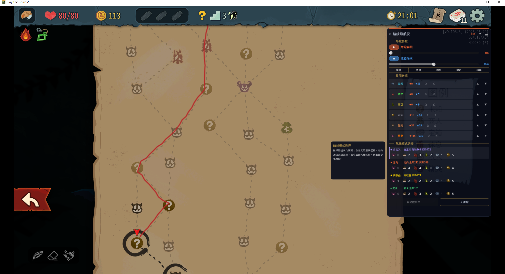
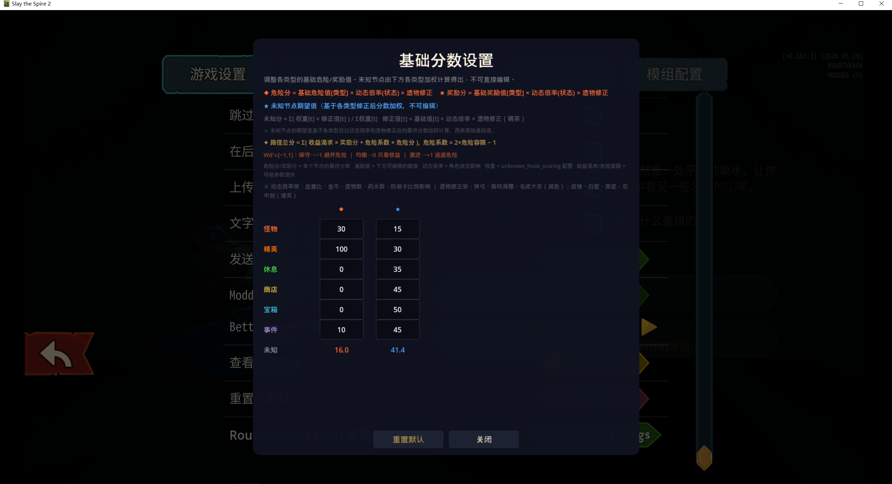

<a id="readme-top"></a>

<!-- LANGUAGE SWITCH -->
<div align="center">

English | [简体中文](README_CN.md)

</div>

<!-- PROJECT POSTER -->
<div align="center">
  
</div>

---

<!-- PROJECT LOGO -->
<br />
<div align="center">

<h3 align="center">🗺️ Route Planner</h3>

  <p align="center">
    Intelligent route optimization mod for Slay the Spire 2 — stop guessing, let data guide your climb.
    <br />
    <a href="https://github.com/llzcx/STS2-RoutePlanner"><strong>Explore the docs »</strong></a>
    <br />
  </p>

  <!-- PROJECT SHIELDS -->
[![Contributors][contributors-shield]][contributors-url]
[![Forks][forks-shield]][forks-url]
[![Stargazers][stars-shield]][stars-url]
[![Issues][issues-shield]][issues-url]
[![License][license-shield]][license-url]

  <p align="center">
    <a href="https://github.com/llzcx/STS2-RoutePlanner/issues/new?labels=bug&template=bug-report---.md">Report Bug</a>
    &middot;
    <a href="https://github.com/llzcx/STS2-RoutePlanner/issues/new?labels=enhancement&template=feature-request---.md">Request Feature</a>
  </p>
</div>


<!-- TABLE OF CONTENTS -->
<details>
  <summary>Table of Contents</summary>
  <ol>
    <li>
      <a href="#about-the-project">About The Project</a>
      <ul>
        <li><a href="#key-features">Key Features</a></li>
        <li><a href="#built-with">Built With</a></li>
      </ul>
    </li>
    <li>
      <a href="#getting-started">Getting Started</a>
      <ul>
        <li><a href="#prerequisites">Prerequisites</a></li>
        <li><a href="#installation">Installation</a></li>
      </ul>
    </li>
    <li><a href="#usage">Usage</a></li>
    <li><a href="#scoring-model">Scoring Model</a></li>
    <li><a href="#roadmap">Roadmap</a></li>
    <li><a href="#contributing">Contributing</a></li>
    <li><a href="#license">License</a></li>
    <li><a href="#contact">Contact</a></li>
  </ol>
</details>


<!-- ABOUT THE PROJECT -->
## 📖 About The Project

Route Planner replaces gut-feeling route selection with a **dual-dimension dynamic programming engine**. It evaluates every reachable path on the map, computing a composite score from danger and reward — each adjusted in real-time by your character's state and relics.

No more "this path feels right." Let the data guide your climb.

### Key Features

- 🧠 **DP-Powered Route Search** — Depth-first dynamic programming finds the optimal path in milliseconds, starting from your **current position** — not just the map origin. Works mid-act at any point.
- ⚖️ **Dual-Dimension Scoring** — Every node scored independently on Danger and Reward, combined via configurable weights
- 🩸 **Adaptive State Awareness** — Low HP? Block deficit? No potions? Danger scores adjust in real-time based on your condition
- 🏆 **Relic-Aware Corrections** — Sling of Courage, War Hammer, Black Star and more automatically tweak elite node scores
- 🎚️ **Continuous Parameter Tuning** — Two sliders (Danger Tolerance, Reward Pursuit) give you infinite granularity, plus 5 quick presets
- 📊 **Base Score Editor** — Full GUI to customize danger/reward base values per node type with formula transparency
- 🔒 **Node Constraints** — Set per-type ≥/≤ limits — target exactly the path you want
- 🎯 **Priority Mode** — Rank node types by importance; the engine finds the best route matching your priorities
- 🎨 **Native Map Drawing** — Routes rendered directly on the game map via the built-in drawing API — no overlay hacks. Fully visible to all players in co-op multiplayer.
- 🗺️ **Dual Boss Support** — Handles both primary and second boss map points for comprehensive route coverage
- ⚡ **Golden Path Fast Track** — Detects and optimizes linear golden path corridors for instant results
- 🌐 **i18n Support** — Full Chinese / English switching, easy to extend
- 🔥 **Config Hot-Reload** — Edit JSON configs while the game runs; changes apply instantly

<p align="right">(<a href="#readme-top">back to top</a>)</p>


### Built With

- [![C#][CSharp]][CSharp-url] .NET 9.0
- [![Godot][Godot]][Godot-url] 4.5.1 Mono
- Harmony — Runtime patching

<p align="right">(<a href="#readme-top">back to top</a>)</p>


<!-- GETTING STARTED -->
## 🚀 Getting Started

### Prerequisites

- Slay the Spire 2 (Godot 4.5.1 Mono build)
- .NET 9.0 Runtime

### Installation

1. Download the latest `RoutePlanner_v1.1.0.zip` from [Releases](https://github.com/llzcx/STS2-RoutePlanner/releases)
2. Extract to your game's `mods/RoutePlanner/` directory
3. Ensure the structure looks like:
   ```
   mods/RoutePlanner/
   ├── manifest.json
   ├── route_planner.dll
   ├── config/
   │   ├── route_planner_scoring.json
   │   └── route_planner_settings.json
   └── locale/
       ├── en.json
       └── zh.json
   ```
4. Launch the game — the Route Navigator panel appears automatically on the map screen

<p align="right">(<a href="#readme-top">back to top</a>)</p>


<!-- USAGE -->
## 💻 Usage

### Quick Start

Enter a map. The panel auto-appears with a pre-computed route. Click a preset:

| Preset | Vibe |
|--------|------|
| **保守 (Safe)** | Avoid all danger — survival priority |
| **求稳 (Cautious)** | Avoid danger, moderate rewards |
| **均衡 (Balanced)** | Equal weight on both |
| **激进 (Aggressive)** | Seek danger, hunt elite loot |
| **极端 (Extreme)** | Max danger + max reward — all-elite path |

### Fine-Tuning

1. Adjust **Danger Tolerance** and **Reward Pursuit** sliders
2. Enable **Auto Draw** — routes update in real-time
3. Switch between 4 route modes: **Custom**, **Target** (priority-based), **High Reward**, **Safe**

### Advanced

- Open the **gear icon** (Base Score Editor) to customize scoring formulas
- Set **per-type node constraints** (≥ min / ≤ max) in Star Chart
- Reorder **node priorities** with ▲▼ to guide Target mode
- Edit `config/route_planner_scoring.json` for deep tuning — changes hot-reload

<p align="right">(<a href="#readme-top">back to top</a>)</p>


<!-- SCORING MODEL -->
## 📐 Scoring Model

<div align="center">
  
  <p><em>Base Score Editor — adjust danger/reward values per node type with live formula preview</em></p>
</div>

```
FinalDanger = BaseDanger[type] × DangerMultiplier(state) × EliteRelicCorr
FinalReward = BaseReward[type] × RewardMultiplier(state) × EliteRelicCorr

RouteScore = Σ ( RewardWeight × RewardScore + DangerCoeff × DangerScore )
DangerCoeff = 2 × DangerWeight − 1   (range: −1 to +1)
```

| State | Effect |
|-------|--------|
| Low HP (<30%) | Danger ×1.30 |
| Block card ratio low | Danger ×1.25 |
| No potions | Danger ×1.15 |
| Low gold | Shop reward ×0.90 |
| Few relics | Treasure/Event reward ×1.10 |
| Full HP | Rest site reward ×0.90 |

| Relic | Correction |
|-------|-----------|
| Sling of Courage | Elite danger −10% |
| Booming Conch | Elite danger −10% |
| Fur Coat | Marked elite danger −10% |
| War Hammer / White Star / Black Star | Elite reward +10% |
| Sword of Stone | Elite reward +5% (<4 elites killed) |

<p align="right">(<a href="#readme-top">back to top</a>)</p>


<!-- ROADMAP -->
## 🗺️ Roadmap

- [ ] Route risk analysis — highlight the most dangerous node on each route
- [ ] History backtrack — record and compare previous route choices
- [ ] Multi-route side-by-side comparison (2–3 routes)
- [ ] Community-shared scoring presets
- [ ] Node detail preview on route hover

See the [open issues](https://github.com/llzcx/STS2-RoutePlanner/issues) for a full list of proposed features.

<p align="right">(<a href="#readme-top">back to top</a>)</p>


<!-- CONTRIBUTING -->
## 🤝 Contributing

Contributions are what make the open-source community amazing. Any contributions are **greatly appreciated**.

1. Fork the Project
2. Create your Feature Branch (`git checkout -b feature/AmazingFeature`)
3. Commit your Changes (`git commit -m 'feat: Add some AmazingFeature'`)
4. Push to the Branch (`git push origin feature/AmazingFeature`)
5. Open a Pull Request

<p align="right">(<a href="#readme-top">back to top</a>)</p>


<!-- LICENSE -->
## 🎗 License

Copyright © 2025 [Shiang Chen](https://github.com/llzcx).

Released under the [MIT][license-url] license.

<p align="right">(<a href="#readme-top">back to top</a>)</p>


<!-- CONTACT -->
## 📧 Contact

Shiang Chen — [@llzcx](https://github.com/llzcx)

Project Link: [https://github.com/llzcx/STS2-RoutePlanner](https://github.com/llzcx/STS2-RoutePlanner)

<p align="right">(<a href="#readme-top">back to top</a>)</p>


<!-- STAR HISTORY -->
## ⭐ Star History

<div align="center">
  <a href="https://star-history.com/#llzcx/STS2-RoutePlanner&Date">
    
  </a>
</div>


<!-- REFERENCE LINKS -->
[contributors-shield]: https://img.shields.io/github/contributors/llzcx/STS2-RoutePlanner.svg?style=flat-round
[contributors-url]: https://github.com/llzcx/STS2-RoutePlanner/graphs/contributors
[forks-shield]: https://img.shields.io/github/forks/llzcx/STS2-RoutePlanner.svg?style=flat-round
[forks-url]: https://github.com/llzcx/STS2-RoutePlanner/network/members
[stars-shield]: https://img.shields.io/github/stars/llzcx/STS2-RoutePlanner.svg?style=flat-round
[stars-url]: https://github.com/llzcx/STS2-RoutePlanner/stargazers
[issues-shield]: https://img.shields.io/github/issues/llzcx/STS2-RoutePlanner.svg?style=flat-round
[issues-url]: https://github.com/llzcx/STS2-RoutePlanner/issues
[license-shield]: https://img.shields.io/github/license/llzcx/STS2-RoutePlanner.svg?style=flat-round
[license-url]: https://github.com/llzcx/STS2-RoutePlanner/blob/master/LICENSE
[CSharp]: https://img.shields.io/badge/C%23-512BD4?style=flat-round&logo=csharp&logoColor=white
[CSharp-url]: https://dotnet.microsoft.com/en-us/languages/csharp
[Godot]: https://img.shields.io/badge/Godot-478CBF?style=flat-round&logo=godotengine&logoColor=white
[Godot-url]: https://godotengine.org/
